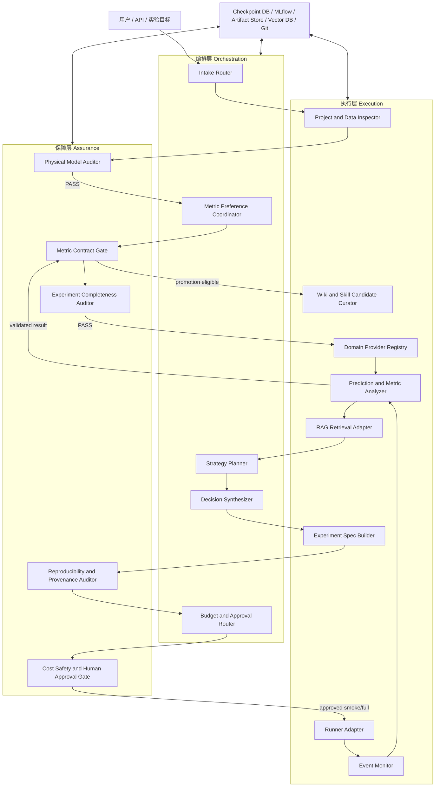

# RFC: RAG 多智能体深度学习策略优化系统

- **Status:** Draft for review
- **Date:** 2026-07-15
- **OpenSpec change:** `build-rag-multi-agent-dl-strategy-system`
- **Target worktree:** `exp/hybrid-rag`
- **Implementation status:** Not authorized by this document

## Context

当前产品由 `pinn_hybrid_rag` 组合根、`rules_mcp` 确定性症状路由、`hybrid_rag` 概念/词项/字符 n-gram 排序以及只读 stdio MCP 边界组成。它的优势是离线、确定性、零外部运行依赖和来源可追踪；不足是不能主动管理实验生命周期，也没有向量检索、运行状态持久化、实验指标系统记录、过程监督或经过治理的知识沉淀。

目标系统不是让多个 Agent 自由讨论后直接修改代码和启动训练，而是把 Agent 置于显式工作流、确定性工具和不可绕过的保障门禁中。Agent 负责理解、检索、提出候选和解释证据；确定性服务负责单位换算、量纲计算、指标计算、进程控制、产物验证和状态落盘；用户负责关键偏好、歧义参数、高成本动作和晋级动作的最终授权。

## Goals / Non-Goals

**Goals:**

- 建立执行层、编排层和保障层三级隔离的多 Agent 架构。
- 使用 LangGraph 表达可检查、可暂停、可恢复、可回放的实验状态机。
- 覆盖需求确认、物理模型审计、方案生成、决策、smoke、full-run 审批、监控、指标复核和知识沉淀。
- 在优化前要求用户确认指标优先级，并基于完整预测场定位局部、边界、时间和物理区域误差。
- 在实验前校对单位、量纲、数值范围、代码内换算和无量纲化链式缩放。
- 保留当前确定性检索作为可解释基础层，引入向量数据库补充改写、跨语言和历史实验召回。
- 将实验 Wiki 和 Skill 视为通过验证流程晋级的知识产品，而不是 Agent 的自由记忆。
- 默认 smoke-first、单逻辑改动、明确预期指标和回滚条件。

**Non-Goals:**

- 第一阶段不自动修改已有 PINN 源码，不自动安装依赖，不自动启动完整训练。
- 不用 LLM 代替数值指标、量纲、哈希、进程状态或统计检验的确定性计算。
- 不把 LangGraph checkpoint、向量数据库或聊天记录当作实验事实来源。
- 不把范围扩展到 PINN 之外的所有深度学习任务；但 PINN 核心从一开始就不得依赖单一传热方程、相变指标、固定 ROI 或 FEM 真值。
- 不让多个 Agent 通过共享全局变量、单例或隐式聊天历史传递功能数据。
- 不自动发布 Wiki、Skill 或模型版本。

## Architectural Principles

1. **状态机优先于群聊。** Supervisor 是显式 LangGraph 图，不是自由对话的总管 Agent。
2. **Agent 做判断，服务做计算。** LLM 不直接计算量纲、指标、哈希或进程健康状态。
3. **引用优先于大对象。** 图状态保存 `run_id`、`artifact_uri` 和报告引用，不保存权重、大数组或完整日志。
4. **保障门禁不可绕过。** 物理审计、指标偏好、完整性、成本和人工审批是状态转换条件。
5. **原始数据不可被派生索引替代。** Git、实验记录和 artifact store 是事实来源，向量库可重建。
6. **先 smoke 后 full。** smoke 只验证闭环和失败方向，不能被表述为科学有效性结论。
7. **一次只改变一个逻辑点。** 每个候选实验必须声明唯一 intervention、预期指标和回滚条件。
8. **知识只从已验证实验晋级。** 未通过审计的总结只能保留为候选或失败记录。
9. **通用核心不含领域假设。** 用户模型定义物理权威；领域指标、ROI 生成和参考适配通过显式插件注入，案例阈值只保存在案例契约中。

## Universal Core, Domain Plugins and Case Contracts

```text
Universal PINN Core
  versioned contracts, LangGraph gates, unit/conversion audit,
  generic field metrics, localization, decision policy and RAG interfaces
    |
    +--> Domain Provider
    |      optional metrics, residual/context extraction, ROI proposals,
    |      domain validation and strategy compatibility metadata
    |
    +--> Case Contract
           user physical model, model unit system, reference evidence,
           selected metrics, guardrails, ROI/time preferences and budgets
```

- 通用核心 SHALL NOT import heat-transfer, fluid, elasticity, wave or inverse-problem implementations.
- 领域 provider SHALL implement a versioned interface and receive all data explicitly; providers SHALL NOT exchange functional state through globals or singletons.
- 案例契约 SHALL be authoritative for enabled providers and thresholds. A provider being installed does not authorize its metrics for a case.
- 当前 PINN-2D 传热模型 SHALL remain a validation case. Its SI declarations, FEM reference, phase metrics and ROI SHALL NOT become core defaults.

## Three-Layer Architecture



保障层在逻辑上包围所有关键转换，而不是只在流程结束时进行一次复核。

## Component Responsibilities

| Component | Layer | LLM-backed | Responsibility | Forbidden responsibility |
| --- | --- | --- | --- | --- |
| Intake Router | 编排 | 可选 | 解析目标、任务类型和缺失上下文 | 猜测缺失物理单位 |
| Metric Preference Coordinator | 编排 | 是 | 向用户询问真值来源、指标优先级、ROI 和阈值 | 自动设置最终指标权重 |
| Strategy Planner | 编排 | 是 | 基于审计报告和 RAG 证据生成单变量候选 | 直接执行 shell 或训练 |
| Decision Synthesizer | 编排 | 是 | 按用户契约、证据质量、成本和风险选择候选 | 用单一 MSE 覆盖守护指标 |
| Project and Data Inspector | 执行 | 混合 | 读取入口、配置、数据 manifest 和历史 run | 修改源文件 |
| RAG Retrieval Adapter | 执行 | 混合 | 组合规则、稀疏、稠密和元数据过滤检索 | 把向量结果当作事实 |
| Experiment Spec Builder | 执行 | 混合 | 生成结构化实验规格和 staging 配置 | 覆盖用户配置 |
| Runner Adapter | 执行 | 否 | 在已批准环境中启动、停止和恢复任务 | 自主扩大运行范围 |
| Event Monitor | 执行 | 否为主 | 采集日志、checkpoint、GPU、NaN 和产物事件 | 持续将完整日志发送给 LLM |
| Prediction and Metric Analyzer | 执行 | 否为主 | 计算指标、误差位置、ROI、物理约束和对照差异 | 解释性地篡改数值 |
| Domain Provider Registry | 执行 | 否 | 按案例契约加载领域指标、上下文和 ROI provider | 把已安装 provider 自动应用到所有 PINN |
| Physical Model Auditor | 保障 | 混合 | 单位、量纲、用法链路、范围和无量纲化审计 | 在歧义时静默换算 |
| Completeness Auditor | 保障 | 否为主 | 校验代码、数据、环境、seed、baseline、预算和输出 | 自动补造缺失证据 |
| Metric Contract Gate | 保障 | 否 | 强制主指标、守护指标和诊断指标语义 | 将所有指标擅自合并为单分数 |
| Reproducibility Auditor | 保障 | 否 | 校验哈希、版本、参数、产物和重放条件 | 接受不可追踪结果 |
| Cost/Safety/HITL Gate | 保障 | 混合 | 对写文件、安装、full run、发布和删除动作中断审批 | 绕过用户决定 |
| Wiki/Skill Curator | 执行 | 是 | 从已验证记录生成候选知识 | 自动晋级为正式知识 |

## Explicit Data Contracts

所有跨模块数据使用版本化、可序列化的显式对象。建议至少定义：

```text
ExperimentRequest
ProjectSnapshot
DatasetManifest
EnvironmentManifest
PhysicalParameterRecord
PhysicalParameterAuditReport
UnitSystemContract
PhysicalModelAuthority
ReferenceEvidence
MetricPriorityContract
ExperimentCompletenessReport
CandidateStrategy
DecisionRecord
ExperimentSpec
RunManifest
MonitorEvent
PredictionAnalysisReport
ModelEvaluationReport
MetricReport
ReproducibilityReport
ArtifactRef
WikiEntryCandidate
SkillCandidate
ApprovalRecord
```

核心图状态只保存小型状态和引用：

```text
WorkflowState
  workflow_id
  project_snapshot_ref
  request
  status
  physical_audit_ref
  metric_contract_ref
  baseline_run_ref
  model_evaluation_ref
  candidate_strategy_refs
  selected_strategy_ref
  approval_refs
  active_run_ref
  monitor_event_cursor
  metric_report_ref
  reproducibility_report_ref
  knowledge_candidate_refs
  failure
```

图节点不得通过模块级可变变量、单例、临时工作目录猜测或隐式 Agent 记忆获得业务数据。

## Workflow State Machine

```text
INTAKE
  -> PROJECT_SNAPSHOT_READY
  -> PHYSICAL_AUDIT_PENDING
  -> NEEDS_UNIT_CONFIRMATION | PHYSICAL_AUDIT_PASSED
  -> METRIC_PRIORITY_PENDING
  -> NEEDS_METRIC_PRIORITY | METRIC_CONTRACT_CONFIRMED
  -> COMPLETENESS_AUDIT_PENDING
  -> NEEDS_EVIDENCE | READY_FOR_DIAGNOSIS
  -> MODEL_EVALUATION_READY
  -> CANDIDATES_READY
  -> DECISION_READY
  -> NEEDS_EXPERIMENT_APPROVAL
  -> SMOKE_RUNNING
  -> SMOKE_INVALID | SMOKE_VALIDATED
  -> NEEDS_FULL_RUN_APPROVAL
  -> FULL_RUNNING
  -> RESULT_INVALID | RESULT_VALIDATED
  -> KNOWLEDGE_CANDIDATES_READY
  -> COMPLETED
```

任何 `NEEDS_*` 状态都必须通过持久化 interrupt 等待用户输入，恢复时不得重做已成功的只读审计节点。

## Physical Parameter and Dimensional Audit

### Canonical parameter record

每个参数必须同时保留原始值和规范值：

```json
{
  "symbol": "rho",
  "meaning": "density",
  "raw_value": 4.43,
  "raw_unit": "g/cm^3",
  "canonical_value": 4430.0,
  "canonical_unit": "kg/m^3",
  "dimension": "M L^-3",
  "conversion_factor": 1000.0,
  "source_ref": "config.py:42",
  "load_site_ref": "model.py:18",
  "use_site_refs": ["physics.py:67"],
  "confidence": "confirmed",
  "user_confirmed": true
}
```

### Audit sequence

1. 从配置、代码、文档和用户输入中提取参数候选。
2. 从用户模型或显式确认中建立模型内部单位制；SI 只是可选模板，不能作为全局默认判据。
3. 追踪参数的加载位置、已有转换和最终公式，检测遗漏转换和双重转换。
4. 校验 PDE、BC、IC 和源项每一项的量纲一致性。
5. 校验数值范围和数量级，但范围异常只产生证据，不自动替换值。
6. 校验归一化坐标下的一阶、二阶和时间导数链式缩放。
7. 对摄氏度/开尔文、Hz/rad/s、面热流/体积热源等语义不同的单位执行专门规则。
8. 单位缺失、来源冲突或多义时进入 `NEEDS_UNIT_CONFIRMATION`。
9. 生成新的只读标准化 manifest，不覆盖用户原配置。

审计目标是“模型内一致性”，不是“是否采用 SI”。`m` 与 `mm`、`s` 与 `ms` 或 `kg` 与 `g` 可以同时出现在来源中，只要转换链完整并在 PDE/BC/IC use-site 前进入模型声明的单位体系。未声明混用、转换倍率错误或重复转换才是阻断条件。

## Physical Model Authority and Reference Evidence

`PhysicalModelAuthority` 记录用户确认的 PDE、BC、IC、几何、参数来源、输出通道和 `UnitSystemContract`。它决定一个策略是否保持了原问题的物理含义。

`ReferenceEvidence` 是独立、可选、可多源的证据，包括解析解、实验、高保真数值解、教师场或观测数据。每个证据必须引用其适用的 `PhysicalModelAuthority`，并记录坐标、单位、输出通道和适用范围。

- FEM 仅在案例明确声明时成为该案例的数值参考，不是系统默认真值。
- 没有参考场时，系统使用用户选择的 PDE residual、BC/IC、守恒、观测和参数恢复指标；不得伪造 MSE、RMSE 或 `max_abs`。
- `ModelEvaluationReport` 汇总通用指标和领域 provider 结果；`PredictionAnalysisReport` 只作为存在对齐参考场时的一种证据。

### PINN derivative scaling

对于 `x_hat=(x-x0)/L` 和 `t_hat=(t-t0)/tau`，审计器必须验证：

```text
d/dx   = (1/L) d/dx_hat
d2/dx2 = (1/L^2) d2/dx_hat2
d/dt   = (1/tau) d/dt_hat
```

热源中心、半径、边界法向和输出归一化必须与残差中的尺度一致。

## Metric Priority and Prediction Analysis

### User-confirmed contract

优化前必须向用户确认：

- 用户物理模型权威的版本，以及可选参考证据的类型和版本；
- 主指标及字典序/Pareto 优先级；
- 守护指标及最大允许退化；
- 诊断指标；
- 用户指定、领域 provider 要求或诊断阶段提出的可选 ROI/时窗；
- 最小有效改善、预算和回滚阈值。

系统不得在用户未授权时把指标线性压缩成单一分数。判定顺序为：硬约束通过、主指标比较、守护指标检查、诊断指标解释。

### Error localization report

当案例存在对齐参考场并选择 reference-backed 指标时，`PredictionAnalysisReport` 至少包含：

- MSE、RMSE、MAE、relative L2、`max_abs` 和百分位误差；
- `max_abs` 的 `(x,y,z,t,channel)`、预测值、参考值和符号误差；
- top-k 极值位置及去重后的高误差连通区域；
- `max_abs` 和 ROI 指标随时间的轨迹；
- 同位置的 PDE residual、BC/IC 状态、采样密度、几何标签和已启用领域 provider 上下文；
- 仅当案例启用相应 provider 时才包含相变、流体、弹性、波动或逆问题专用指标；
- baseline 与候选在同一网格、同一时间和同一参考真值上的差值；
- 最大误差是否只是从一个位置迁移到另一个位置。

只有物理审计、指标契约和有效 `ModelEvaluationReport` 均存在时，Decision Synthesizer 才能生成优化决定。只有 reference-backed 指标要求预测场对齐与定位报告。

## Decision Policy

每个 `CandidateStrategy` 必须声明：

```text
observed_failure_mechanism
supporting_evidence_refs
single_intervention
unchanged_controls
expected_primary_metric_movement
guardrail_limits
smoke_budget
full_budget
falsification_condition
rollback_plan
```

候选排序优先使用用户定义的字典序或 Pareto 约束。成本、风险和证据质量用于打破同等级候选，不得覆盖硬约束和用户主指标。数值超参数搜索由确定性优化器执行，Agent 只负责提出搜索空间和解释结果。

## RAG Architecture

当前确定性检索作为 Tier 0 保留：

```text
Symptom rules and explicit anchors
  -> metadata scope filter
  -> sparse retrieval
  -> dense vector retrieval
  -> deterministic fusion
  -> evidence-conflict check
  -> reranking
  -> provenance validation
```

### Indexed corpora

- 当前 PINN 手册和正式技术文档；
- 经过验证的项目入口、配置说明和代码地图；
- 已通过完整性审计的实验报告；
- 已批准的 Wiki 条目和 Skill 版本；
- 结构化失败报告。

默认不索引未经验证的 Agent 对话、无来源摘要或未完成训练的推测性结论。

### Required metadata

```text
source_sha256
source_uri
line_range
repo_commit
experiment_id
run_id
dataset_hash
environment_hash
model_family
pde_family
task_type
domain_provider_id
output_channels
dimensional_signatures
failure_signatures
framework
document_type
validation_status
valid_from
supersedes
```

检索必须先按项目、PDE family、任务类型、物理模型、领域 provider、框架、验证状态和版本做兼容性过滤，再进行稀疏/稠密召回。跨领域策略只有在输入/输出语义、维度签名和失败机制兼容时才能进入决策证据。向量索引可删除和重建，但事实来源不得随索引删除。

## Persistence Boundaries

| Data | Development | Production target | Source of truth |
| --- | --- | --- | --- |
| LangGraph checkpoints | SQLite | PostgreSQL | Workflow state only |
| Run parameters and metrics | Local experiment tracker | Shared tracking server | Yes |
| Models, arrays, figures, logs | Local artifact directory | Object storage | Yes |
| Retrieval index | Local vector DB | Managed/self-hosted vector DB | No, derived index |
| Wiki and Skill source | Git Markdown/JSON | Git review workflow | Yes after approval |
| Audit and approval events | SQLite/PostgreSQL | PostgreSQL append-only table | Yes |

实验 Wiki 是审计记录的可读投影。每个正式条目必须包含 `run_id`、源码提交、数据哈希、环境哈希、指标报告、审计结论和 supersedes 关系。

Skill 的生命周期为：

```text
Repeated validated pattern
  -> SkillCandidate
  -> isolated replay evaluation
  -> baseline comparison
  -> human review
  -> versioned publication
  -> vector indexing
```

## Execution and Supervision

### Permission levels

| Action | Default policy |
| --- | --- |
| Read code/config/logs and compute audits | Automatic |
| Generate a new staging config | Automatic, no overwrite |
| Modify an existing file | Backup plus explicit approval |
| Run smoke in an approved environment | Allowed after experiment approval |
| Install packages or alter environment | Explicit dependency approval |
| Start a full/expensive run | Separate human approval |
| Publish model, Wiki or Skill | Separate promotion approval |
| Delete or overwrite user data | Never automatic |

### Event-driven monitoring

Runner 和 Monitor 产生结构化事件：

```text
RUN_QUEUED
RUN_STARTED
METRIC_UPDATED
CHECKPOINT_WRITTEN
LOSS_SPIKE
NAN_DETECTED
GPU_OOM
LOG_STALLED
ARTIFACT_MISSING
EARLY_STOP_TRIGGERED
RUN_FINISHED
RUN_FAILED
```

普通事件由阈值和状态机处理。只有异常、里程碑或指标冲突触发 Agent 解释，避免持续把完整日志传给 LLM。

## Failure and Recovery Semantics

- 每个节点必须幂等，或在副作用前记录 idempotency key。
- 训练启动节点必须先写入 `RunManifest`，再调用执行后端。
- 恢复时从最近成功 checkpoint 继续，不重复执行已经成功的只读节点。
- 任一保障门禁失败都产生结构化失败报告，不静默跳过。
- smoke 失败不能触发自动扩大训练或放宽物理条件。
- 指标计算失败、参考数据缺失或网格未对齐时，结果状态为 `RESULT_INVALID`，不得进入 Wiki/Skill。
- 删除和覆盖不作为自动恢复策略。

## Validation Strategy

### Contract tests

- 所有数据模型的 schema、版本和必填字段；
- 图节点只消费声明的输入并只返回声明的输出；
- 无全局可变状态和隐式依赖。

### Physical audit fixtures

- `kg/m^3` 与 `g/cm^3`；
- `J/(kg K)` 与 `J/(g K)`；
- `m`、`mm` 和归一化坐标；
- `W/m^2` 与 `W/mm^2`；
- `W/m^3` 与 `W/mm^3`；
- 摄氏度/开尔文绝对温度语义；
- 重复转换和缺失转换；
- 一阶、二阶和时间导数链式缩放。
- 完整转换下允许 `m/mm` 混用，以及缺失转换时拒绝同样的混用；
- 至少一个非 SI、非传热的自洽模型单位体系。

### Metric analysis fixtures

- 人工构造的单点极值、多个热点和连通区域；
- 最大误差位置迁移；
- 平均误差改善但 guardrail 退化；
- 时间后期发散；
- 通过显式 provider 加载的相界面 IoU 和熔池几何；
- 不加载任何传热 provider 的非热 PINN 通用指标与自定义 provider；
- 不同网格/时间未对齐时拒绝比较。

### Workflow tests

- 所有 `NEEDS_*` interrupt 和恢复路径；
- smoke-first 与 full-run 审批不可绕过；
- 节点失败后的 checkpoint 恢复；
- 重复请求不重复启动训练；
- 无效结果不能进入知识层。

### Retrieval tests

- 当前确定性九类症状基准保持通过；
- 改写、跨语言和历史实验召回；
- 元数据过滤和来源哈希；
- 证据冲突降权；
- 索引删除后从事实来源重建。

## Rollout Plan

### Phase 0: Contracts and read-only graph

- 冻结领域模型、状态机、Agent 输入输出和审计状态。
- 使用内存/SQLite checkpoint 构建只读图。
- 复用当前 MCP 作为隔离的检索 provider。
- 不修改 PINN 代码，不启动训练。

### Phase 1: Local governed smoke loop

- 增加物理参数审计、指标偏好 interrupt 和完整性审计。
- 接入本地实验跟踪、artifact 目录和本地向量数据库。
- 仅允许生成 staging 配置和获批 smoke。
- 建立预测场误差定位与 metric contract gate。

### Phase 2: Process supervision and durable storage

- 引入持久化数据库、事件表和共享实验跟踪服务。
- 接入 Windows、WSL 和远端执行 adapter，但保持相同 `RunManifest`。
- 实现 checkpoint、日志和资源事件监督。

### Phase 3: Knowledge curation

- 生成带证据引用的 Wiki 候选。
- 实现 SkillCandidate、回放评测和人工晋级。
- 建立知识 supersedes 和失效策略。

### Phase 4: Strategy optimization

- 增加多候选和 Pareto/字典序决策。
- 接入确定性超参数优化器和多 seed 复核。
- 在通过预算和人工审批后支持完整训练。

## Decisions

### Decision 1: Keep the existing retriever as an isolated provider

当前 `pinn-hybrid-rag` SHALL 通过适配器被 LangGraph 调用，不直接吸收编排、训练和持久化职责。

**Alternative:** 把所有逻辑合入 MCP server。Rejected，因为会破坏物理隔离并让检索服务承担副作用。

### Decision 2: Use explicit gates rather than prompt-only policy

物理审计、指标优先级、smoke-first 和 full-run 审批 SHALL 由图边和状态条件强制执行。

**Alternative:** 仅在 system prompt 中提醒 Agent。Rejected，因为提示词不能提供可验证的不可绕过性。

### Decision 3: Preserve raw and canonical physical parameters

单位转换 SHALL 生成派生 manifest，并保留原值、单位、因子和来源。

**Alternative:** 原地重写用户配置。Rejected，因为会破坏证据和增加双重转换风险。

### Decision 4: Do not reduce metrics to one scalar by default

决策 SHALL 使用硬约束、用户主指标和守护指标的分层比较。

**Alternative:** 固定加权 MSE/RMSE 分数。Rejected，因为平均指标可能掩盖局部和物理退化。

### Decision 5: Treat vector storage as a derived index

向量数据库 SHALL 可从 Git、实验系统记录和 artifact metadata 重建。

**Alternative:** 直接把 Wiki、实验事实和记忆只保存在向量库。Rejected，因为难以审计和版本化。

### Decision 6: Build a universal PINN core from the first release

MVP SHALL remain PINN-focused but its core SHALL be PDE/domain-neutral. Heat transfer is one domain provider and validation case; at least one non-thermal provider path SHALL prove the isolation boundary before release.

**Alternative:** Build a heat-transfer core and generalize later. Rejected because domain assumptions would leak into contracts, graph gates, retrieval metadata and learned skills.

## Risks / Trade-offs

- [Risk] 三级架构增加实现和运维复杂度。 -> Mitigation: 分阶段交付，Phase 0/1 保持本地和最小 Agent 数量。
- [Risk] LLM 生成的候选存在不稳定性。 -> Mitigation: 固定结构化输出、检索证据、单变量约束和确定性 gate。
- [Risk] 单位存在上下文语义，自动解析可能误判。 -> Mitigation: 保留来源链路，歧义进入用户确认，不静默修复。
- [Risk] 向量召回产生相关但错误的证据。 -> Mitigation: 元数据过滤、来源校验、规则层和冲突检查。
- [Risk] Wiki/Skill 被错误结论污染。 -> Mitigation: 只允许 `RESULT_VALIDATED` 且人工批准的候选晋级。
- [Risk] checkpoint 和 artifact 状态不一致。 -> Mitigation: RunManifest 先写、幂等键、追加式事件和恢复审计。
- [Risk] Agent 过多导致延迟、成本和责任模糊。 -> Mitigation: MVP 使用少量专业节点，确定性功能不包装为 Agent。

## Open Questions

- 首批除传热外选择哪个非热 PINN provider 作为持续回归资产？
- 向量数据库采用本地进程、容器还是远端服务？
- 中文/英文、代码和实验报告分别采用哪些 embedding 与 sparse 表示？
- 实验跟踪与 artifact store 在本地阶段采用何种部署形式？
- 首批执行后端只支持 Windows，还是同时支持 WSL 和 AutoDL？
- 哪些 smoke 动作可以在一次项目级批准后自动重复，哪些必须逐次批准？
- Wiki 使用纯 Markdown、静态站点还是带数据库的前端作为展示层？
- Skill 的评测阈值、失效条件和 supersedes 策略如何定义？
